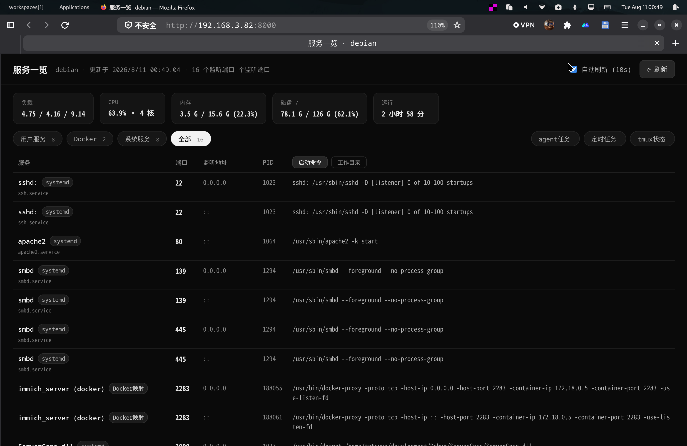

# svc-dashboard

本机监听服务一览表 —— 在浏览器里列出服务器当前后台运行的对外 TCP 服务，并展示系统负载/CPU/内存/磁盘状态。

纯 Python 标准库实现，零第三方依赖。访问 `http://<服务器>/` 即可使用（默认监听 80 端口）。



## 功能

- **服务列表**：端口号、监听地址、PID、启动命令、工作目录、服务类型
  - 类型标识：`容器`（Docker）/ `systemd`（含单元名）/ `进程`（直接启动）
  - 分类筛选 chips：**用户服务**（默认）/ Docker / 系统服务 / 全部
    - "用户服务" = 自己启动的进程 + Docker 容器 + `/etc/systemd/system/` 下的自定义 systemd 单元
    - "系统服务" = 发行版自带的 systemd 单元（sshd / apache2 / smbd / xrdp 等），默认隐藏
  - **点击端口号直接跳转**到对应服务：`http://<主机>:<服务端口>/`（而不是在 dashboard 路径后拼接）
    - 仅监听本机回环地址（127.0.0.1）的服务会标"仅本机"，链接指向 `127.0.0.1`
- **系统信息卡片**：1/5/15 分钟负载、CPU 使用率与核心数、内存用量、根分区磁盘用量、开机时长
  - 打开页面时抓取一次快照，之后停住；点"刷新"按钮才更新
- **刷新**：打开页面即同步扫描一次拿最新状态;手动刷新按钮;可选 10 秒自动刷新(默认关闭,需手动勾选;仅刷新服务列表,不动系统信息)。**无后台自动刷新线程** —— 没人访问时 dashboard 进程完全静默,不消耗 CPU/IO
- **agent 任务面板**：点击顶部 `agent任务` chip，查看正在运行的 agent（OMP 会话 + Codex 进程）：
  - 状态（运行中 / 阻塞 / 空闲 / 已完成）、tmux 窗格、工作目录、最近活动时间、当前工具
  - **点击任务标题展开详情**：最近 18 条会话日志时间线（工具调用、消息、结果、压缩、结束）+ 所在 tmux 窗格的实时终端画面，可原地刷新
- **tmux 状态面板**：点击 `tmux状态` chip，列出全部 tmux 窗格（会话/窗格、命令、标题、目录、尺寸），当前活动窗格有标识
- **定时任务面板**：点击 `定时任务` chip，查看 systemd timer 与 cron 任务（看门狗 / 提醒 / 定时，共 24 项），含周期、来源、命令、最近执行时间
- **服务管理面板**：点击 `服务管理` chip，对本机关键 systemd 单元提供 **启动 / 停止 / 重启 / 暂停(SIGSTOP) / 恢复(SIGCONT)** 操作，当前受管单元：
  - `zircon-server.service`（Mir3 传奇3 服务器主进程）
  - `zircon-bots.service`（AI 机器人运行器）
  - `tailscaled.service`（Tailscale 组网）
  - 状态含 ActiveState / PID / 是否被 SIGSTOP 挂起，10 秒自动轮询；所有操作前端 confirm 确认后经 `POST /api/manage` 执行（走免密 sudo 的 systemctl）
- **JSON API**：
  - `GET /api` —— 服务列表：`{"updated": 时间戳, "services": [{ip, port, pids, name, cmdline, cwd, type, unit, scope, ...}]}`
  - `GET /api/sys` —— 系统信息：`{"hostname", "loadavg", "cpu_usage", "cpu_count", "mem": {...}, "disk": {...}, "uptime"}`
  - `GET /api/omp` —— agent 聚合：`{"omp": [...], "codex": [...]}`（OMP 会话 + Codex 进程）
  - `GET /api/tmux` —— tmux 窗格列表
  - `GET /api/agentlog?sid=&cwd=&tmux=` —— 某 agent 的会话日志时间线 + 终端画面
  - `GET /api/manage?unit=<id>` —— 受管单元状态（id ∈ zircon-server / zircon-bots / tailscaled）
  - `POST /api/manage` —— 执行管理操作：body `{"unit": "<id>", "action": "start|stop|restart|pause|resume"}`

## 多语言 (i18n)

界面支持 **中文 / English / 日本語** 三语，按浏览器 `Accept-Language` 自动切换：

- 请求带 `Accept-Language: ja` / `ja-JP` → 日语；`en*` → 英语；`zh*` 或无语言头 → 中文（默认）
- 可用 `?lang=en|ja|zh` 查询参数强制覆盖（便于测试/手动切换）
- 页面语言对服务表、chips、系统信息卡、看门狗/agent/tmux 面板、服务管理面板与 API 消息全部生效
- `GET /api/tasks`、`GET /api/agentlog`、`GET /api/manage` 均按请求语言的 `Accept-Language` 返回对应文案

## 工作原理

非 root 用户无法读取其他用户/root 进程的 `/proc/<pid>/fd`（内核权限限制），因此程序采用两层信息收集：

1. 扫描 `/proc/net/tcp` 与 `/proc/net/tcp6` 找出所有 LISTEN socket，通过 inode 反查进程；
2. 用户访问页面时同步执行一次 `sudo -n ss -H -tlnp` 补齐 root/其他用户服务的 PID、名称、cgroup 等(失败时自动降级,页面照常显示)。**无后台线程、无定时刷新** —— 完全按需加载。

## 快速开始

```bash
# 1. 克隆
git clone https://github.com/iamcheyan/svc-dashboard.git
cd svc-dashboard

# 2. 直接运行（前台，Ctrl+C 退出）
python3 dashboard.py

# 3. 浏览器打开
# http://127.0.0.1/
```

命令行参数：

| 参数 | 说明 | 默认 |
|---|---|---|
| `--port <N>` | 监听端口 | `80` |
| `--host <IP>` | 监听地址 | `0.0.0.0` |

## 注册为开机自启服务

推荐用 systemd user 服务（无需 root）。项目内置单元模板 `svc-dashboard.service`：

```bash
# 修改 ExecStart/WorkingDirectory 中的路径为你的项目实际路径后：

mkdir -p ~/.config/systemd/user
cp svc-dashboard.service ~/.config/systemd/user/

systemctl --user daemon-reload
systemctl --user enable --now svc-dashboard.service
systemctl --user status svc-dashboard.service

# 关键：开启 linger，让用户服务在登出/重启后依然运行
loginctl enable-linger $USER
```

验证：

```bash
systemctl --user is-enabled svc-dashboard.service   # enabled
systemctl --user is-active svc-dashboard.service    # active
loginctl show-user $USER | grep Linger              # Linger=yes
curl -s http://127.0.0.1/api | head -c 200     # JSON 正常返回
```

服务日志：

```bash
journalctl --user -u svc-dashboard -f
```

## 注意事项

- **权限**：需要免密 sudo（`sudo -n`）才能完整显示 root/其他用户服务的 PID 与命令；没有 sudo 时这些服务的 PID 栏显示为空，其余功能不受影响。
- **端口冲突**：80 是特权端口，需 root 运行（`sudo python3 dashboard.py`，或把 systemd 服务设为系统服务）；如果 80 已被占用，改端口：`python3 dashboard.py --port 8080`，或编辑服务单元的 `ExecStart` 追加 `--port` 参数后 `systemctl --user daemon-reload && systemctl --user restart svc-dashboard.service`。
- 默认只显示"用户服务"分类，系统服务（sshd/apache 等）默认隐藏，点"系统服务"chip 可查看全部。

## 许可证

MIT
